## 금융 상품 비교 애플리케이션
#  FINPICK

### 📓 프로젝트 개요
- 설명 : 예금 상품 조회 및 추천 서비스
- 기간 : 2024.11.18(월) ~ 2023.11.27(수)

### ⚙ 주요 기능

- 시중은행의 예/적금 상품 및 옵션에 따른 금리 조회/비교
- 실시간 환율 계산기
- 원하는 장소의 은행 지점 정보 제공
- AI 챗봇 활용 예/적금 상품 추천 알고리즘 

## 1. 팀원 정보 및 업무 분담 내역 

|이름|역할 및 구현 기능|
|--|--|
|권유주(팀장)|Backend : 예/적금 상품 모델 정의, 금융상품통합비교공시 API 활용 금융 상품 데이터 저장, 게시글 생성, 한국수출입은행 환율정보 API 활용 환율 계산 로직 구현, OpenAI API를 활용한 금융 상품 추천 챗봇 로직 구현   Frontend : 메인페이지, 예/적금 금리 비교(전체/상세 조회), 환율 계산기, 챗봇, 전체 페이지 css 스타일링 |
|김민수(팀원)|Frontend : 컴포넌트 구조 설계, 회원가입, 로그인, 로그아웃, 프로필 페이지, pinia 활용, 메인페이지, 주변 은행 검색, 카카오맵API 활용 지도 출력   Backend : ERD 설계, allauth, django_rest_auth 활용 유저 정보 저장 및 커스터마이징, 카카오맵API 호출 |

## 2. 설계 내용(아키텍쳐 등) 및 실제 구현 정도 

#### **📚 백엔드 기술 스택**  
- **언어** : Python  
- **웹 프레임워크** : Django, Django REST Framework (DRF)  
- **데이터베이스** : SQLite (개발 환경), 
- **인증 및 권한** :  
  - `dj-rest-auth` 및 `django-allauth`를 활용한 사용자 인증  
  - 토큰 기반 인증 (Token Authentication)  
- **외부 API 연동** :  
  - **금융감독원 예/적금 비교 API** : 예/적금 상품정보 수집 및 금리 변환   
  - **한국수출입은행 환율 API** : 환율 데이터 수집 및 금액 변환  
  - **카카오 지도 API** : 주소 검색 및 은행 위치 검색  
  - **OpenAI API** : 사용자 맞춤 금융 상품 추천
- **챗봇 금융 상품 추천** :  
  - Vuetify의 `v-card`, `v-avatar`, `v-img`를 활용한 챗봇 인터페이스  
  - Vue Transition을 통한 부드러운 애니메이션 효과 구현  

---

#### **📑 백엔드 구현 기능**  

1. **회원가입 및 사용자 관리**  
   - 사용자 정보 확장 및 회원가입 시 추가 정보 처리 
   - 사용자 데이터 저장 및 유효성 검사 (`CustomRegisterSerializer`,  `CustomUserDetailsSerializer` 활용)  

2. **게시글 및 댓글 관리**  
   - **게시글(Article)**: 금융 상품 정보를 포함한 게시글 자동 생성  
   - **댓글(Comment)**: 게시글에 대한 댓글 작성 및 조회.  

3. **은행 검색**  
   - **카카오 지도 API**를 이용해 사용자 위치 기반 은행 검색.  
   - 주소 입력(시, 구, 동)으로 위도와 경도 정보를 가져와 근처 은행 위치 제공.  

4. **환율 데이터 처리**  
   - **한국수출입은행 API**를 통해 실시간 환율 데이터 수집 및 업데이트.  
   - 금액 변환 기능 제공 (예: 원화 → 달러 / 달러 -> 원화).  

5. **금융 상품 검색**  
   - 특정 은행명, 가입 조건, 금리 등에 따라 금융 상품 조회 및 필터링. 

6. **챗봇 금융 상품 추천**  
   - OpenAI API를 활용하여 금융 상품 추천 챗봇의 코어 로직 구현
   - 사용자와의 실시간 상호작용을 위한 챗봇 UI 구현  
   - 클릭 가능한 챗봇 아이콘과 대화창 토글 기능 제공  

---

#### **📚 프론트엔드 기술 스택**
- **프레임워크**: Vue.js 3  
- **빌드 도구**: Vite  
- **상태 관리**: Pinia  
- **UI 컴포넌트**: Vuetify (Material Design)  
- **API 통신**: Axios  

---

#### **📑 프론트엔드 구현 기능**

1. **API 요청**
   - Axios를 활용해 백엔드(Django 서버)와 통신하며, 사용자 인증, 게시글, 금융 상품 정보를 가져오고 생성.  

2. **회원가입 및 로그인**
   - `signUp`과 `logIn` 메서드를 통해 사용자 인증 처리.  
   - 인증 후 JWT 토큰을 저장 및 사용하여 API 요청.  

3. **상태 관리**
   - Pinia를 사용하여 애플리케이션 상태(사용자 정보, 토큰, 게시글 등)를 관리.  
   - 페이지 전환 시 상태 유지 및 필요한 데이터 공유.  

4. **UI 구성**
   - Vuetify를 활용하여 Material Design 스타일의 사용자 친화적인 UI 컴포넌트 구성.  

## 3. 데이터베이스 모델링 (ERD)

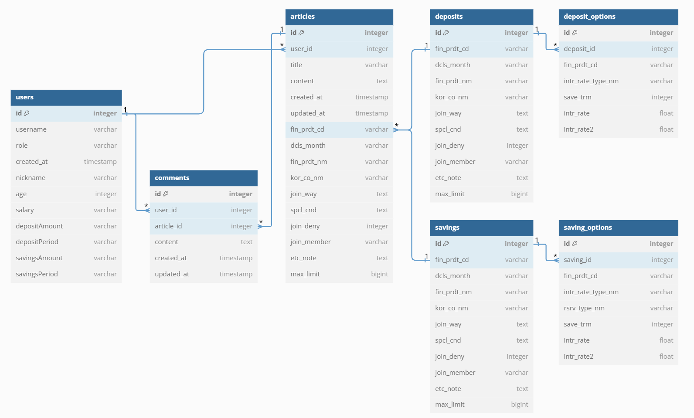

## 4. API 명세서

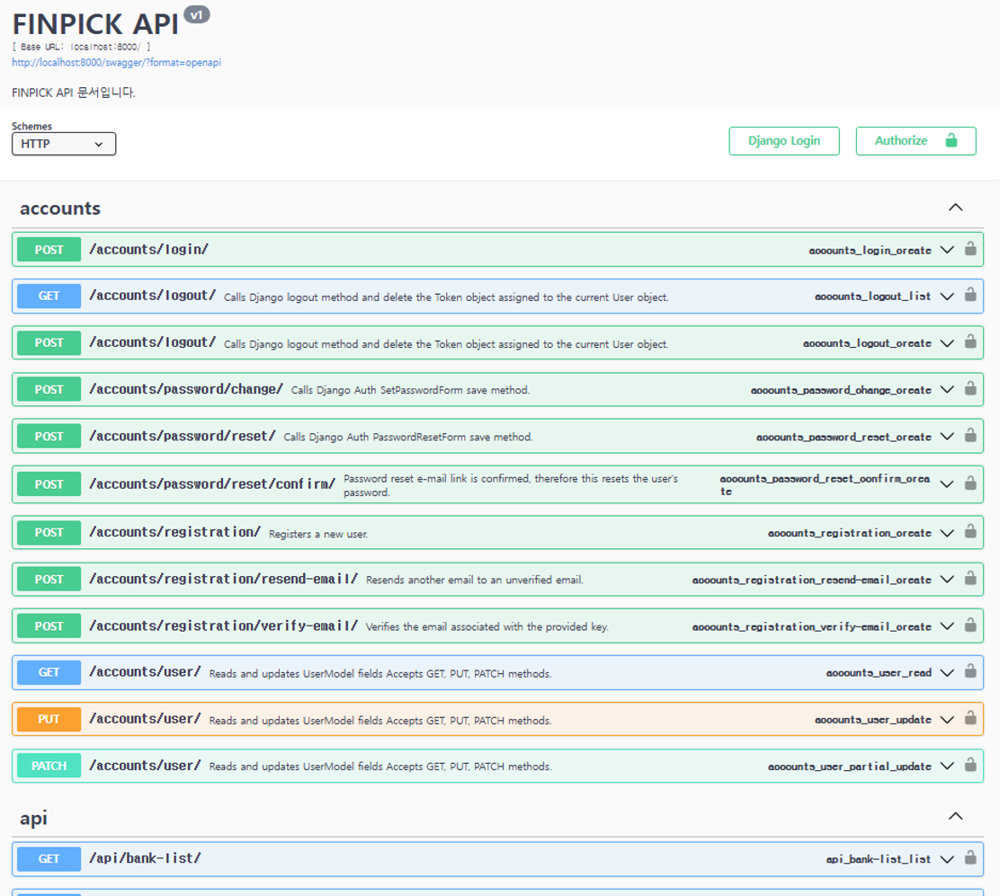

## 5. OpenAI API를 활용한 금융 상품 추천 챗봇
- OpenAI API를 활용한 금융 상품 추천 챗봇으로 사용자의 입력(희망 조건, 투자 성향 등)을 분석해 맞춤형 금융 상품을 추천
- Django 백엔드에서 제공하는 예/적금 데이터를 OpenAI 모델 입력으로 활용, GPT-4의 자연어 처리 능력을 통해 직관적이고 이해하기 쉬운 응답을 생성
- Vue.js와 Vuetify로 구성된 반응형 UI를 통해 사용자와의 실시간 상호작용이 가능하도록 구현

## 6. 서비스 대표 기능 설명 

### 1️⃣ 메인 페이지 

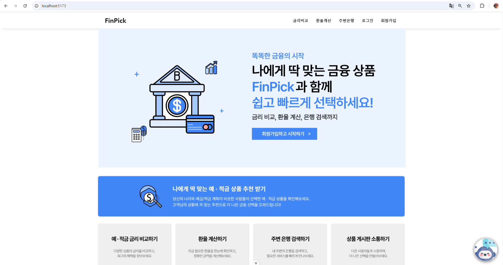

- 네비게이션 바에서 로그인/회원가입, 금리비교, 환율계산기, 주변은행 검색 페이지로 넘어갈 수 있게 라우팅 
- '회원가입하고 시작하기' 클릭 시 로그인페이지로 이동 , 이미 로그인한 사용자라면 금리비교 페이지로 이동 

### 2️⃣ 예/적금 금리비교 페이지 

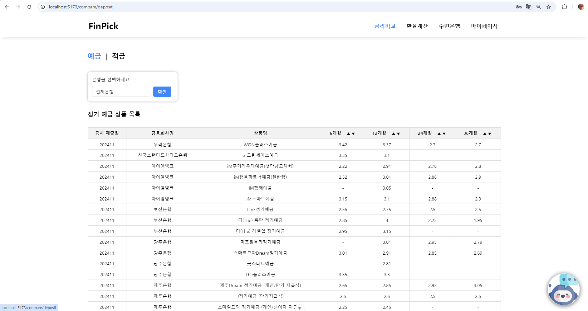
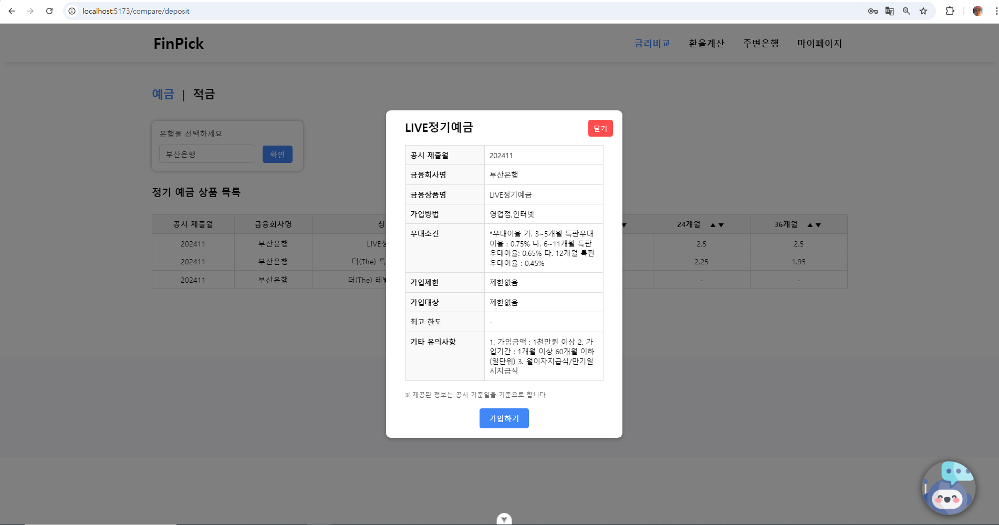

- 예금/적금으로 나뉘어 은행을 선택하면 그 은행이 제공하고 있는 예금/적금 상품 목록 조회 가능 
- 6개월, 12개월, 24개월, 36개월 기간별 금리를 오름차순/내림차순으로 파악 가능 
- 원하는 상품 클릭 시 해당 상품에 대한 상세페이지 팝업 출력 

### 3️⃣ 환율계산기 

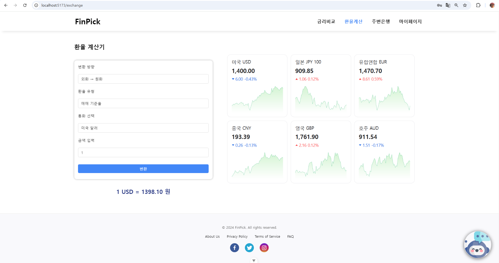

- 변환방향에 따른 환율 계산 (원화 -> 외화 / 외화 -> 원화)  
- 환전 유형에 따른 환율 계산 (매매 기준율, 송금받을때, 송금할 때) 
- 23개국 통화 선택 가능  
- 금액 입력 후 변환 버튼 클릭 시 결과값 출력 

### 4️⃣ 주변 은행 검색 페이지 

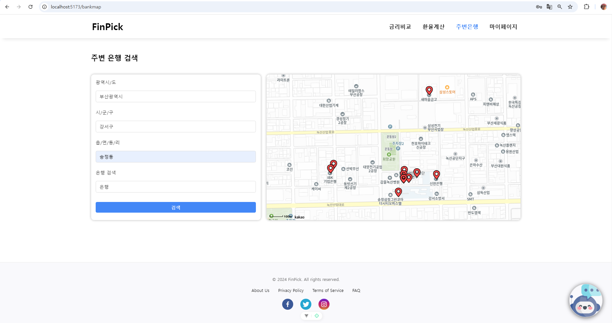

- 광역시/도, 시/군/구, 읍/면/동/리 기준 원하는 지역 선택 시 해당 지역의 은행 조회 가능 
- 원하는 은행이 있을 경우 추가로 '은행 검색' 란을 활용해 검색 (ex. 국민은행, 신한은행 등)
- 지역을 설정하고 '검색' 버튼 클릭 시 지도 좌표가 해당 지역으로 변경, gps 포인터로 은행 위치 확인 

### 5️⃣ 회원가입, 로그인 페이지  

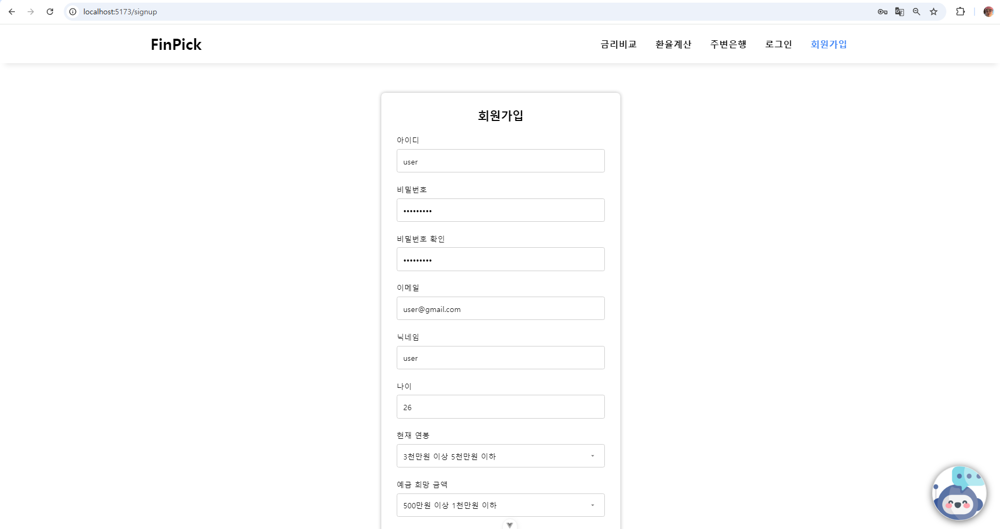
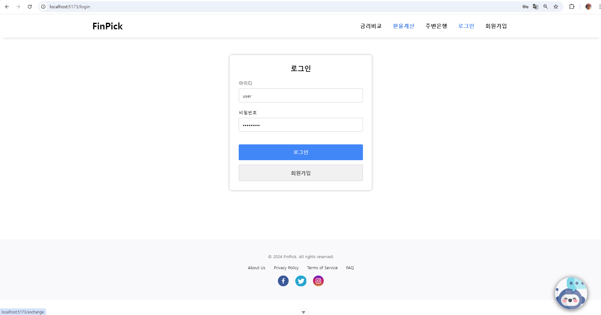

- 회원가입, 로그인 시 필요한 정보를 드롭다운 형태로 저장 

### 6️⃣ 마이페이지 

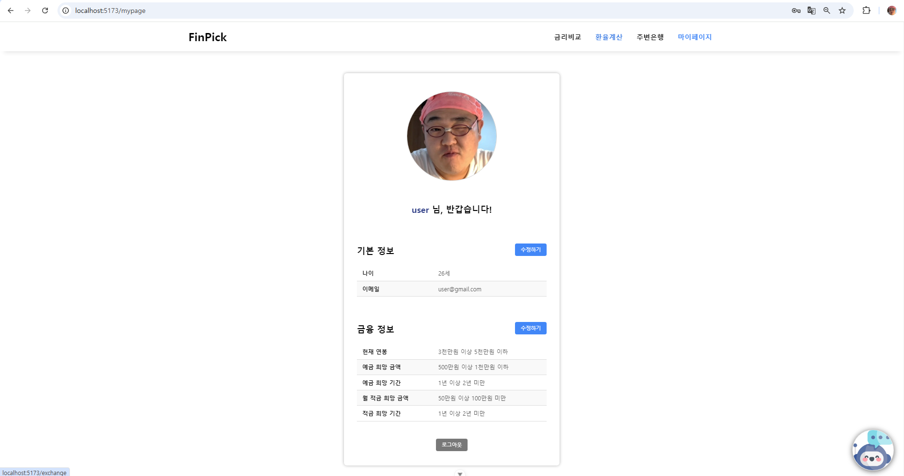

- 유저 정보 확인 

### 7️⃣ OpenAI API를 활용한 금융 상품 추천 챗봇

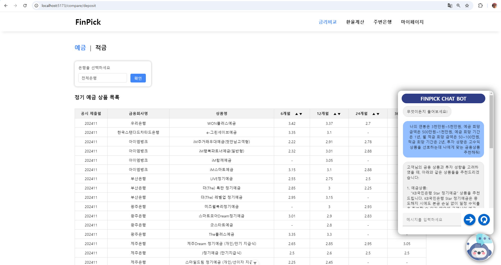

  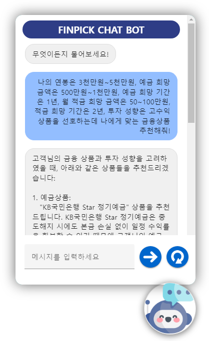
  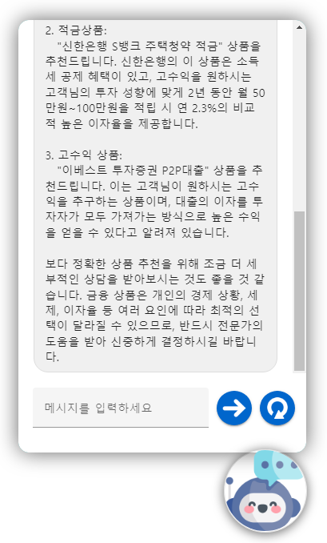

- 사용자의 질문을 수집하고 OpenAI API를 호출하여 적합한 금융 상품을 추천

## 7. 느낀 점 , 후기 

|이름|느낀 점, 후기|
|--|--|
|권유주(팀장, Backend)| 1학기 동안 배웠던 내용을 일주일이라는 짧은 기간 안에 총집합하여 다양한 기능을 구현하면서 많은 것을 배울 수 있었습니다. 특히 외부 API를 연동해 금융 상품 데이터를 저장하고, OpenAI API를 활용해 맞춤형 추천 챗봇을 구현하는 과정에서 큰 성장을 느꼈습니다. 혼자였다면 어려웠을 프로젝트였지만, 민수 오빠와 팀으로 협업하며 역할을 잘 분담한 덕분에 성공적으로 마무리할 수 있었습니다. 지금까지 배운 기술들을 실제 서비스로 연결하고 적용한 점이 가장 보람찼고, 이번 경험을 기반으로 더 발전된 서비스를 개발하고 싶습니다. 마지막으로, 함께 고생해준 민수 오빠 감사합니다! |
|김민수(팀원, Frontend)| 쉽게 본 기능은 쉽지 않았고, 어려울 것이라 지레 겁먹은 기능은 크게 어렵지 않았습니다. 여태 배운 것들을 최대한 활용해서 어느 위치에 어떤 코드를 작성해야 할지 먼저 생각하며 코드를 작성하다 보니 시간이 오래 걸렸지만 대신 확실하게 코드를 이해할 수 있었습니다. 이번 프로젝트에서는 짧은 시간만이 주어져 주어진 과업들을 쳐내는 데 급급했지만 수업시간에 들은 내용들을 녹여내 나만의 서비스를 만들고, 새로운 것들을 많이 배울 수 있어 보람찼습니다. 같이 팀으로서 고생해준 유주에게도 정말 감사합니다! |